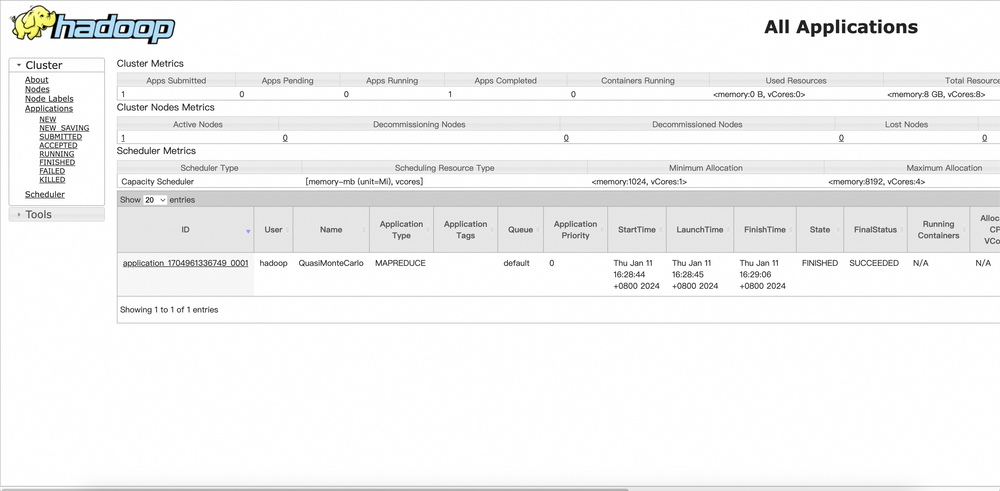

## Create a Hadoop Cluster Instance

To create a Hadoop Cluster instance, a HadoopCluster resource definition must be created and applied. HadoopCluster Kubernetes Operator creates the necessary resources, such as Services and StatefulSet, in the same namespace in which the HadoopCluster was defined.

First, create a YAML file to define a HadoopCluster resource named **hello-world.yaml**.

Then copy and paste the below snippet into the file and save it:

```yaml
apiVersion: kubecluster.org/v1alpha1
kind: HadoopCluster
metadata:
  name: hadoopcluster-sample
spec:
  yarn:
    serviceType: NodePort
```

Next, apply the **hello-world.yaml** by running:

```bash
> kubectl apply -f hello-world.yaml                                                                                   
hadoopcluster.kubecluster.org/hadoopcluster-sample created
```

Now that we have created a Hadoop Cluster, run the following command to view it:

```bash
kubectl get hdcs
```

Output similar to：

```bash
> kubectl get hdc                                             
NAME                   AGE     STATE
hadoopcluster-sample   2m23s   Created
```

The Hadoop Cluster Operator creates Pods to simulate nodes in a physical Hadoop cluster. Run the following command to view the created Pods：

```bash
> kubectl get pods -o wide
NAME                                   READY   STATUS    RESTARTS   AGE     IP               NODE   NOMINATED NODE   READINESS GATES
hadoopcluster-sample-datanode-0        1/1     Running   0          96s     10.244.0.100     k8s    <none>           <none>
hadoopcluster-sample-namenode          1/1     Running   0          7m25s   10.244.0.96      k8s    <none>           <none>
hadoopcluster-sample-nodemanager-0     1/1     Running   0          5m55s   10.244.0.99      k8s    <none>           <none>
hadoopcluster-sample-resourcemanager   1/1     Running   0          6s      10.244.0.101     k8s    <none>           <none>
```

As you can see, there is a Pod that simulates **NameNode**, DataNode, NodeManager, and ResourceManager. If you need more Pods to run more tasks, you can adjust the number of associated Datanodes and Nodemanagers

Now let's try logging in to a node and running a MapReduce application:
```bash
> kubectl exec -it hadoopcluster-sample-resourcemanager /bin/bash
kubectl exec [POD] [COMMAND] is DEPRECATED and will be removed in a future version. Use kubectl exec [POD] -- [COMMAND] instead.
bash-4.2$ ls
LICENSE-binary  LICENSE.txt  NOTICE-binary  NOTICE.txt  README.txt  bin  etc  include  lib  libexec  licenses-binary  sbin  share
bash-4.2$ cd share/hadoop/mapreduce/
bash-4.2$ ls         
hadoop-mapreduce-client-app-3.3.1.jar     hadoop-mapreduce-client-hs-plugins-3.3.1.jar       hadoop-mapreduce-client-shuffle-3.3.1.jar   lib-examples
hadoop-mapreduce-client-common-3.3.1.jar  hadoop-mapreduce-client-applicationclient-3.3.1-tests.jar  hadoop-mapreduce-client-uploader-3.3.1.jar  sources
hadoop-mapreduce-client-core-3.3.1.jar    hadoop-mapreduce-client-applicationclient-3.3.1.jar        hadoop-mapreduce-examples-3.3.1.jar
hadoop-mapreduce-client-hs-3.3.1.jar      hadoop-mapreduce-client-nativetask-3.3.1.jar       jdiff
bash-4.2$ hadoop jar hadoop-mapreduce-examples-3.3.1.jar pi 8 1000
Number of Maps  = 8
Samples per Map = 1000
Wrote input for Map #0
Wrote input for Map #1
Wrote input for Map #2
Wrote input for Map #3
Wrote input for Map #4
Wrote input for Map #5
Wrote input for Map #6
Wrote input for Map #7
Starting Application
2024-01-11 08:28:41 INFO  DefaultNoHARMFailoverProxyProvider:64 - Connecting to ResourceManager at hadoopcluster-sample-resourcemanager/10.244.0.101:8032
2024-01-11 08:28:42 INFO  ApplicationResourceUploader:906 - Disabling Erasure Coding for path: /tmp/hadoop-yarn/staging/hadoop/.staging/application_1704961336749_0001
2024-01-11 08:28:42 INFO  FileInputFormat:300 - Total input files to process : 8
2024-01-11 08:28:43 INFO  ApplicationSubmitter:202 - number of splits:8
2024-01-11 08:28:43 INFO  ApplicationSubmitter:298 - Submitting tokens for application: application_1704961336749_0001
2024-01-11 08:28:43 INFO  ApplicationSubmitter:299 - Executing with tokens: []
......
......
Application Finished in 26.166 seconds
Estimated value of Pi is 3.14100000000000000000
bash-4.2$ 
```

## Web Portal
You can access the web interface for NodePort with the serviceType of the corresponding type, and can find the corresponding NodePort Service:
```bash
> kubectl get svc | grep -i nodePort
hadoopcluster-sample-resourcemanager-nodeport   NodePort    10.107.164.217   <none>        8088:31505/TCP                        18m
```

Open a browser and access the corresponding PhyNodeIp:port and you can see a web portal like this:



## Implementation Principle

According to the Hadoop Cluster configuration submitted by the user, the Hadoop Clusetr Operator will create the corresponding configuration file and Pods, and execute the corresponding Hadoop commands, such as: `hdfs datanode/yarn resource manage`r. **Therefore, Hadoop dependencies must be installed on the image used**. By default, Hadoop Cluster Operator uses apache/hadoop:3 as the Pod image.

**if you have any questions, please feel free to issues!**